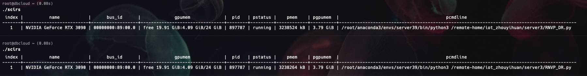

<code>scirs</code>:显示GPU进程的详细信息

&emsp;&emsp;<code>scirs</code>是一个显示GPU进程完整信息的工具，信息包括：显卡索引、显卡名、显卡的`bus_id`,显卡占用大小（`格式： free:Used/total`）、进程ID、进程状态、进程物理内存、进程显卡占用大小，进程的命令以及参数。

***

## 1. 快速开始

序号|英文名称|中文名称|
:---:|:---:|---|
1|index|显卡索引
2|name|显卡名
3|bus_id| 显卡的`bus_id`
4|gpumem | 显卡占用（`格式： free:Used/total`）
5|pid | 进程ID
6|pstatus | 进程状态
7|pmem | 进程物理内存
8|pgpumem | 进程显卡占用
9|pcmdline | 进程命令以及参数
### 1.1 安装

### 1.2 使用

## 2. 结果

&emsp;&emsp; 具体的显示可以参考如下的图片：

